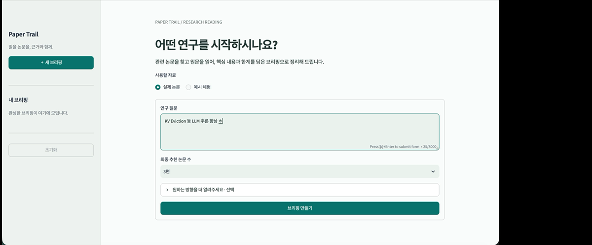
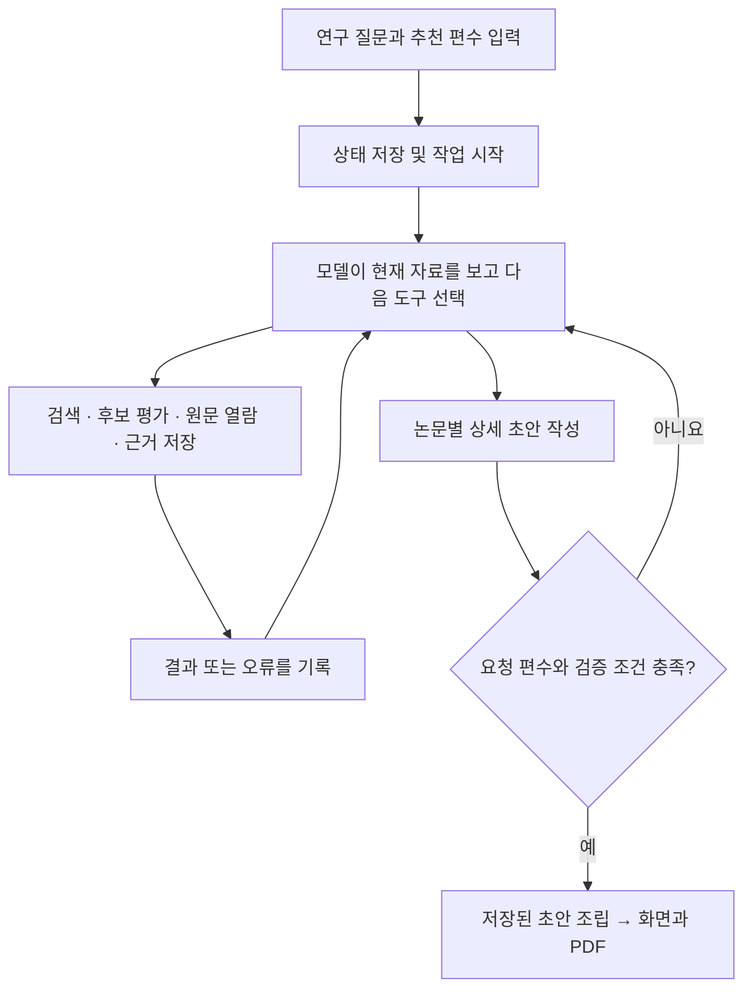

# Paper Trail

**연구 질문에서 논문 탐색, 후보 비교, 원문 검토, 한국어 PDF 브리핑까지 이어 주는 로컬 AI 에이전트입니다.**

[](https://github.com/seewhyDev/Paper-Trail/raw/refs/heads/main/assets/demo/papertrail-demo.mp4)

**[▶ 데모 영상 보기·다운로드 (MP4)](https://github.com/seewhyDev/Paper-Trail/raw/refs/heads/main/assets/demo/papertrail-demo.mp4)** — 위 미리보기를 눌러 전체 영상을 열 수 있습니다. 브라우저에 따라 다운로드될 수 있습니다.

예를 들어 “적은 라벨로 문서 분류를 학습하는 방법을 알고 싶어”라고 입력하면, 공개 학술 자료를 검색하고 후보를 비교한 뒤 **원하는 수의 추천 논문(1~5편, 기본 3편)**을 정리합니다. 각 논문이 다루는 문제, 핵심 방법, 주요 결과, 한계를 웹 화면과 PDF로 확인할 수 있습니다.

Python과 Streamlit으로 실행합니다. **API 키 없이 체험하는 합성 데모**와 **OpenAI API를 사용하는 실제 논문 탐색**을 제공합니다. 별도 데이터베이스, Docker, Codex는 필요하지 않습니다.

## 빠르게 시작하기

### 1. 코드 내려받기

이 GitHub 페이지의 **Code → Download ZIP**으로 내려받아 압축을 풀거나, **Code → HTTPS**의 주소로 복제합니다.

```bash
git clone https://github.com/seewhyDev/Paper-Trail.git
cd Paper-Trail
```

이후 명령은 `app.py`와 `pyproject.toml`이 있는 프로젝트 폴더에서 실행합니다.

### 2. 설치

**Python 3.11 이상**과 패키지 설치용 인터넷 연결이 필요합니다. 검증 환경은 macOS ARM64 / Python 3.11.11입니다. 한글 PDF용 나눔고딕 폰트가 포함되어 있습니다.

macOS / Linux:

```bash
python3 -m venv .venv
source .venv/bin/activate
python -m pip install -e '.[dev]'
[ -f .env ] || cp .env.example .env
```

Windows PowerShell (실기기 미검증):

```powershell
py -3.11 -m venv .venv
.venv\Scripts\Activate.ps1
python -m pip install -e ".[dev]"
if (!(Test-Path .env)) { Copy-Item .env.example .env }
```

### 3. 서버 실행

```bash
python -m streamlit run app.py --server.address 127.0.0.1 --server.port 8502
```

브라우저에서 **http://127.0.0.1:8502**를 엽니다. 사용하는 동안 터미널을 열어 두세요. 이 앱은 인증 기능이 없는 로컬 단일 사용자용이므로 위와 같이 로컬 주소에 바인딩합니다.

### 4. API 키 없이 먼저 체험

1. `＋ 새 브리핑` → `예시 체험`을 선택합니다.
2. 연구 질문을 입력하고 `최종 추천 논문 수`를 선택합니다.
3. `브리핑 만들기`를 누릅니다.
4. 완료되면 `추천 논문`과 `전체 후보 평가` 탭을 살펴보고 `PDF 다운로드`를 누릅니다.

데모는 **미리 작성된 합성 자료와 응답을 재생**합니다. 실제 논문 검색이나 모델의 자율 판단을 수행하지 않으며 API 비용도 없습니다.

## 실제 논문 탐색하기

로컬 `.env` 파일에 자신의 API 키를 입력합니다. `.env.example`은 공유용 템플릿이므로 실제 키를 넣지 마세요.

```dotenv
OPENAI_API_KEY=여기에_자신의_API_키
OPENAI_MODEL=gpt-5.4-mini
OPENAI_REASONING_EFFORT=low
```

키는 [OpenAI API 플랫폼](https://platform.openai.com/)에서 관리합니다. 실제 실행에는 해당 모델을 사용할 수 있는 API 계정과 API 사용 비용이 필요합니다. 기본 모델은 프로젝트 설정값이며, 계정에서 접근 가능한 Responses API·함수 호출 지원 모델로 변경할 수 있습니다.

설정을 변경했다면 앱에서 진행 중인 탐색을 먼저 중지하고, 서버를 `Ctrl+C`로 종료한 뒤 위의 서버 명령으로 다시 실행하세요. 이미 지정된 서버 환경 변수가 `.env`보다 우선합니다.

1. `＋ 새 브리핑` → `실제 논문`을 선택합니다.
2. 연구 질문과 원하는 추천 편수를 입력합니다. 선택 항목에서 연구 방향·제약·이미 읽은 논문을 알려 줄 수 있습니다.
3. `브리핑 만들기`를 누릅니다. 회전 아이콘과 함께 실제 사용 도구, 검색 사이트·검색어, 읽는 논문과 본문 구간을 보여 줍니다.
4. 완료되면 추천 논문을 확인하고 PDF를 내려받습니다.

입력 예시:

> **연구 질문:** 적은 라벨로 문서 분류를 학습하는 방법을 비교하고 싶습니다. 공개 원문에서 실험 조건과 한계를 확인해 주세요.
>
> **원하는 방향:** 비교 실험에 사용할 기준선 후보
>
> **제약 조건:** 데이터와 라벨 수가 다른 결과를 동일 조건의 성능처럼 비교하지 않기

실제 모드에서는 연구 질문과 조회한 본문이 OpenAI로, 검색어가 학술 API로 전송됩니다. 논문 수와 검토량이 늘면 시간과 API 사용량도 증가합니다.

## 어떤 결과가 나오나요?

- **추천 논문:** 제목·저자·연도·논문 링크와 문제, 핵심 방법, 주요 결과, 한계에 대한 설명
- **전체 후보 평가:** 저장된 모든 중복 제거 후보의 평가 이유와 순위. 선정되지 않은 후보도 확인 가능
- **한국어 PDF:** 선정된 논문별 서지정보와 네 항목의 설명. 연구 질문·선정 기준·내부 로그는 제외

검색 소스는 **arXiv, Crossref, Europe PMC**입니다. 공개 arXiv HTML/PDF와 Europe PMC XML을 읽고, Crossref는 메타데이터 검색에 사용합니다.

“모든 후보 비교”는 **검색해 저장된 후보 모두의 제목·초록을 평가한다는 뜻**입니다. 전 세계 논문을 망라하거나 모든 후보의 원문 전체를 읽는다는 뜻은 아닙니다. 초록이 없으면 제목만 확인한 한계를 표시합니다. 추천 후보는 추가로 본문을 읽고 근거를 기록합니다.

## 이 프로그램의 에이전트는 어디에 있나요?

핵심은 [paper_agent/agent.py](paper_agent/agent.py)의 `Agent.run()`입니다. 모델이 현재 연구 상태와 도구 결과를 보고 **다음에 사용할 도구와 인자를 선택**하고, 코드가 실행한 결과를 다시 모델에 전달하는 반복 구조입니다.

예를 들어 검색 결과가 부족하면 질의를 바꾸고, 원문 조회가 실패하면 다른 경로나 후보를 선택할 수 있습니다. 검색어·후보 순위·읽을 구간·브리핑 내용은 모델이 판단합니다. 도구 실행, 상태 저장, 전체 후보 평가 여부와 인용 위치 검사, PDF 생성은 Python 코드가 담당합니다.



프로그램은 **전체 후보 열람·평가 → 전체 비교 → 추천 후보 원문 검토 → 논문별 초안 → 최종 조립**이라는 검증 단계를 강제합니다. 그 안에서 무엇을 검색하고 읽을지는 모델이 선택합니다. 미평가 후보나 잘못된 근거가 있으면 완료를 거부하고 수정할 내용을 돌려줍니다.

처음 코드를 읽는다면 다음 파일부터 확인하세요.

| 파일 | 역할 |
|---|---|
| [agent.py](paper_agent/agent.py) | 상태 → 모델 요청 → 도구 실행 → 관측의 핵심 루프 |
| [provider.py](paper_agent/provider.py) | 모델 지침, OpenAI Responses API 연결 |
| [tools.py](paper_agent/tools.py) | 도구 정의·실행과 결과 검증 |
| [screening.py](paper_agent/screening.py) | 전체 후보 열람·개별 평가·전체 순위 검사 |
| [depth.py](paper_agent/depth.py) | 본문 열람 깊이와 상세 초안의 근거·분량 검사 |
| [progress.py](paper_agent/progress.py) | 새 자료·근거·초안의 진전 추적과 반복 감지 |
| [completion.py](paper_agent/completion.py) | 완료 조건과 저장된 실행의 재개 |
| [sources.py](paper_agent/sources.py) | 학술 검색과 원문 텍스트 추출 |
| [worker.py](paper_agent/worker.py) | 별도 작업 프로세스, 동시 실행 제한·중지 |
| [app.py](app.py) / [pdf.py](paper_agent/pdf.py) | 사용자 화면 / PDF 생성 |

## 실행을 다시 시작하거나 중지하기

다음부터는 프로젝트 폴더에서 가상환경을 활성화하고 서버만 실행하면 됩니다.

```bash
source .venv/bin/activate
python -m streamlit run app.py --server.address 127.0.0.1 --server.port 8502
```

Windows에서는 첫 줄을 `.venv\Scripts\Activate.ps1`로 바꿉니다.

- **이전 결과:** 사이드바의 `내 브리핑`에서 확인합니다. 데이터는 기본 `data/`에 저장됩니다.
- **중단 후 재개:** 재개 가능한 기록에만 `N편 브리핑 완성하기`가 표시됩니다. 자료·초안·사용량을 유지하며 추가 API 비용이 발생합니다.
- **작업 중지:** 앱의 `탐색 중지`를 누릅니다. 브라우저를 닫거나 서버만 종료해도 별도 작업 프로세스는 계속될 수 있습니다.
- **서버 종료:** 작업 중지 후 터미널에서 `Ctrl+C`를 누릅니다.
- **기록 삭제:** `초기화` → 경고 확인 → `모두 삭제`. 저장된 실행·논문·근거·PDF가 삭제되며 복구할 수 없습니다. `.env`와 이미 내려받은 사본은 유지됩니다.

동시에 실행할 수 있는 연구 작업은 1개입니다. 다른 실행이 진행 중이면 종료 후 `탐색 계속하기`를 누르세요.

## 설정과 완료 조건

전체 설정은 [.env.example](.env.example)에 있습니다. `.env`를 수정하고 서버를 재시작하세요.

| 설정 | 기본값 | 의미 |
|---|---:|---|
| `MAX_MODEL_CALLS` / `MAX_FINALIZATION_CALLS` | `auto` / `auto` | 총 호출 횟수를 미리 제한하지 않고 완료까지 진행 |
| `MAX_STALLED_TURNS` | 6 | 진전 없는 연속 호출. 3회째 복구 지시, 6회째 중단 |
| `MAX_CANDIDATES` / `MAX_FULLTEXTS` | 15 / 5 | 활성 후보 목표 상한 / 서로 다른 논문의 원문 시도 수 |
| `MAX_SEARCHES` / `MAX_TOOL_CALLS` | 6 / 80 | 검색 / 도구 사용 상한 |
| `MAX_SECONDS` | 480 | 활성 실행 누적 시간(초) |
| `MAX_TOKENS` / `MAX_OUTPUT_TOKENS` | `auto` / 6500 | 실행 총량은 완료까지 사용 / 응답별 최대 출력 |
| `PAPER_AGENT_DATA` | `data` | 로컬 기록 저장 위치 |

**`auto`는 호출 횟수와 누적 토큰 사용량에 고정 상한을 두지 않는 설정입니다.** 작업이 진행되는 동안 API 비용도 증가합니다. 시간·도구·검색·원문 한도, 반복 감지와 사용자의 중지는 유지되며 외부 오류로 중단될 수도 있습니다. 요청한 편수의 브리핑이 검증되어야 완료로 표시합니다.

총 토큰 예산과 모델의 한 번에 처리할 수 있는 입력량은 별개입니다. `MAX_TOKENS=auto`가 모델 자체의 입력 한도나 `MAX_OUTPUT_TOKENS`를 늘리지는 않습니다. 요청마다 입력·출력량을 예약하고 API가 보고한 실제 사용량으로 정산하며, 실패로 사용량이 불명확하면 예약량을 유지합니다.

고정 상한이 필요하면 `MAX_TOKENS=500000`처럼 숫자를 지정할 수 있습니다. 이 경우 보수적인 입력 추정 때문에 실제 사용량이 상한보다 적어도 다음 요청을 차단할 수 있습니다. 재개 버튼도 같은 계산으로 다음 요청이 가능한지 확인합니다.

일반 설정은 새 실행부터 적용됩니다. UI에서 중단 기록을 재개하면 호출 횟수·총 토큰·반복 감지 정책은 현재 설정을 적용하지만, 기존 자료·초안·누적 사용량과 나머지 한도는 유지합니다. 이전 토큰 제한으로 멈춘 실행도 `MAX_TOKENS=auto`로 서버를 재시작한 뒤 같은 기록에서 이어갈 수 있습니다.

### 이전 버전에서 업데이트하기

진행 중인 탐색과 서버를 중지한 뒤 프로젝트 폴더에서 가상환경을 활성화하고 실행합니다.

```bash
git pull --ff-only
python -m pip install -e '.[dev]'
```

기존 `.env`는 Git 업데이트로 바뀌지 않습니다. 예전 호출·토큰 제한을 해제하려면 `.env`의 해당 항목을 직접 수정하세요. API 키와 다른 설정은 유지합니다.

```dotenv
MAX_MODEL_CALLS=auto
MAX_FINALIZATION_CALLS=auto
MAX_TOKENS=auto
```

서버를 다시 실행하고 중단된 기록의 `N편 브리핑 완성하기`를 누릅니다. 저장된 초안에서 이어가며 추가 API 비용이 발생합니다. 시간·도구 한도가 이미 소진된 기록은 이 설정만으로 재개되지 않습니다.
