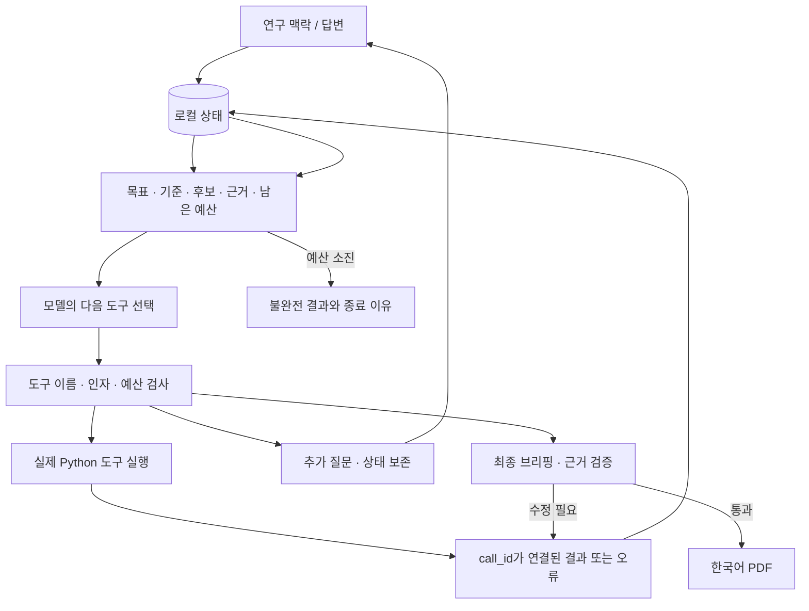

# 아키텍처와 에이전트 루프

## 세 가지 제어 흐름

| 단계 | 다음 행동을 정하는 주체 | 외부 근거 | 예제 |
|---|---|---|---|
| 단순 LLM | 한 번의 호출을 하는 코드 | 별도 확보 없음 | `python examples/three_levels.py direct` |
| 고정 워크플로 | 코드가 검색→상위 후보 PDF→앞 두 청크→요약 순서 결정 | 실제 검색·제한된 원문 구간; 실패 시 대체 판단 없음 | `python examples/three_levels.py workflow` |
| 실제 에이전트 | 모델이 관측 후 다음 도구·인자·종료 결정 | 읽은 원문 청크와 검증된 인용 | `python examples/three_levels.py agent` |

세 예제는 모두 키가 있을 때 실제 API를 사용합니다. `agent`는 앱의 worker와 같은 루프를 실행합니다. `workflow`는 앱의 검색/원문/청크 도구를 재사용합니다. **데모의 ReplayProvider는 네 번째 범주인 고정 시나리오 재생**이며 실제 에이전트의 자율성 증거가 아닙니다.

## 모듈

```text
app.py                    사용자 입력, 상태 조회, 답변/중지, 다운로드
paper_agent/worker.py     별도 프로세스, 실행 잠금, hard timeout, PDF 후처리
paper_agent/agent.py      상태→모델→검증→도구→관측→다음 결정
paper_agent/provider.py   OpenAI Responses SDK 경계, Call/Turn DTO
paper_agent/history.py    최신 상태와 관측 유지, 근거 기록을 마친 이전 원문 축약
paper_agent/tools.py      함수 JSON Schema, 실행, 후보 평가, 최종 검증
paper_agent/screening.py  모든 후보 열람·개별 평가·전체 비교의 필수 검사
paper_agent/sources.py    Crossref/arXiv/Europe PMC, HTML/XML/PDF 추출
paper_agent/network.py    URL 제한, rate limit, timeout, 제한된 retry
paper_agent/schema.py     연구 상태, 후보, 근거, 브리핑 Pydantic 스키마
paper_agent/store.py      JSON 원자적 교체, private state/public trace 분리
paper_agent/pdf.py        검증된 구조화 데이터→한글 PDF
paper_agent/demo.py       합성 학술 자료 + 명시적으로 고정된 응답 스크립트
paper_agent/evaluation.py 실제 모델/합성 관측의 행동 평가
```



루프는 다음 순서를 구현합니다. 검색 전략·평가·순위·원문 구간은 모델이 결정하며, 프로그램은 전체 후보의 제목·초록 열람 → 개별 평가 → 전체 비교가 완료되기 전 원문 검토와 제출을 제한합니다.

1. `state_view()`가 목표, 기준, 사용자 답변, 후보·근거·조회 상태, 남은 예산을 구성합니다.
2. `provider.respond()`에 상태, 앞선 tool 결과, 현재 단계에서 허용된 함수 스키마를 전달합니다.
3. 응답의 모든 `function_call`을 읽고 각 `call_id`를 보존합니다.
4. `validate_call()`로 이름·타입·범위·추가 필드·인자 크기를 검사합니다.
5. `ToolExecutor.execute()`가 실제 네트워크/상태 함수를 실행합니다.
6. 성공·실패 모두 `function_call_output`으로 같은 `call_id`에 연결합니다.
7. 상태를 저장하고 다음 모델 호출이 그 관측을 보도록 합니다.
8. 질문 대기, 검증된 제출, 명시적 불완전 종료 또는 예산 상한에서 멈춥니다.

OpenAI SDK 경계는 교체할 수 있습니다. 다른 공급자는 `respond(conversation, tools, max_output_tokens, timeout) -> Turn` 인터페이스를 구현하면 됩니다. 프로토콜은 현재 Responses 형식이므로 다른 공급자로 갈 때 대화 항목 변환도 어댑터 책임입니다. 멀티에이전트·LangChain·MCP를 추가하지 않았습니다.

## 모델의 결정과 프로그램의 책임

| 모델 | 프로그램 |
|---|---|
| 연구 질문 해석·선정 기준 제안 | 사용자의 원래 맥락 보존 |
| 검색 소스·검색어·페이지 선택 | 허용된 API 요청, 중복 제거, 결과 보존 |
| 상세/원문/청크 선택 | 실제 텍스트 추출과 읽은 구간 기록 |
| 원문 실패 후 다른 경로/후보 선택 | 오류 반환, 제한된 재시도 |
| 관련성 판단, 유지·제외·교체 | 평가·변경 이력 기록 |
| 자료 충분성, 추가 질문, 조기 종료 | 질문 대기·재개, 예산 강제 종료 |
| 최종 선정과 한국어 주장·해석 | 출력 스키마, 근거 위치/quote, PDF 생성 |

`decision`은 간결한 행동 설명 필드입니다. 내부 사고 과정을 요구하지 않습니다. SDK reasoning 항목의 읽을 수 있는 summary는 버리고 필요한 encrypted protocol item만 private state에 유지합니다. UI와 공개 trace는 이 대화 항목을 노출하지 않습니다.

## 도구

| 도구 | 핵심 입력 | 관측과 상태 변화 |
|---|---|---|
| `set_criteria` | goal, criteria | 해석한 목표·선정 기준 |
| `search_papers` | source, query, limit, offset | 후보 ID·메타데이터·초록 일부, 검색 기록 |
| `get_metadata` | paper_id, abstract_offset | 상세·초록 최대 5,000자, 다음 offset |
| `fetch_fulltext` | paper_id, route | 저장된 본문과 목차; 읽음 처리하지 않음 |
| `list_sections` | paper_id, offset | 20청크씩 ID·위치·길이; 다음 offset |
| `read_chunks` | paper_id, chunk_ids | 최대 4청크 실제 텍스트, 열람 범위 기록 |
| `assess_candidate` | verdict, reason, relevance, notes | 평가와 근거 ID, 이전 평가 |
| `ask_user` | question | waiting으로 전환; 답변 후 같은 대화 재개 |
| `submit_briefing` | briefing | 검증 통과 시 completed, 실패 시 보완 목록 |
| `stop_incomplete` | reason | best_effort 평가·이전 실행에서 불완전 종료. 새 실제 실행에서는 제공하지 않음 |

도구 하나가 HTML 실패 후 PDF를 자동 선택하지 않습니다. `auto`는 소스의 기본 경로 한 번을 뜻합니다. 네트워크 일시 오류의 같은 요청 재시도는 프로그램 책임이며 연구 전략 변경과 다릅니다.

한 응답의 여러 도구 호출은 순서대로 실행하고 각각 결과를 반환합니다. 질문/종료 이후 남은 호출은 실행하지 않고 사유를 연결해 반환합니다. 이 제어 도구들은 단독 호출하도록 프롬프트에 명시합니다. 강제 종료 도중 미확정 호출은 `execution_interrupted`로 기록하며 재생하지 않습니다.

## 근거의 보증 범위

`Paper.chunks[chunk_id]`는 원문 URL·절/페이지·정규화 텍스트의 문자 위치를 가집니다. PDF의 페이지는 실제 PDF 1-based 페이지입니다. HTML/XML의 문자 위치는 추출·공백 정규화된 해당 절/문단 구간 기준이며 출판사 뷰어의 바이트 오프셋이 아닙니다. 실제 읽음은 `read_chunks`에서만 기록합니다.

노트는 실제 열람한 청크의 정확한 부분 문자열 quote를 포함해야 합니다. 최종 선정은 `keep` 평가, 원문 확보, 실제 열람이 있어야 하며 주요 필드의 evidence ID가 같은 논문을 가리켜야 합니다. 비교 주장은 선정 논문 내 근거를 사용하며 여러 논문 비교에는 두 논문 이상을 인용해야 합니다. 읽기 순서는 선정 목록과 정확히 일치해야 합니다.

이는 참조 무결성 검증입니다. 인용이 주장을 의미적으로 뒷받침하는지, 해당 논문이 신뢰할 만한지, 방법 비교가 타당한지는 보장하지 않습니다. 근거가 없는 수치를 생성하지 않도록 지시하되 사람의 검토를 대체하지 않습니다.

## 상태·중복 실행·복구

UI는 2초마다 파일을 읽습니다. 모델 요청은 명시적 시작/답변 재개로 띄운 별도 프로세스에서만 발생합니다. 각 스냅샷은 임시 파일에 `fsync` 후 원자 교체하며 디렉터리/파일 권한은 가능한 OS에서 0700/0600으로 생성합니다. worker는 전역 잠금과 실행별 잠금을 잡습니다.

상태는 `ready → running → waiting/completed/incomplete/error/cancelled`, 답변은 `waiting → ready`입니다. 정상 재시작은 완료된 실행을 호출하지 않습니다. 모델 요청 직전 호출 횟수/토큰을 예약하고 도구 직전 예산을 기록합니다. 강제 종료 시 외부 요청이 서버에서 성공했는지 확정할 수 없는 구간이 있어 무조건 재시도하지 않습니다. 분산 환경의 exactly-once 보장을 주장하지 않습니다.

긴 결과는 ID와 위치를 유지한 채 구간별 반환합니다. 원본 대화는 로컬 상태에 보존합니다. 모델 입력에서는 과거 상태 스냅샷을 최신 하나로 대체하고, 근거 노트가 있는 청크 또는 평가를 마친 후보의 이전 read_chunks 결과 본문은 위치와 재조회 안내로 축약합니다. 가장 최근 턴의 실제 도구 관측과 call_id 연결은 유지합니다. 무손실 무한 메모리를 제공하지 않습니다. 입력이 커지면 토큰 입장 검사로 종료될 수 있습니다. 서로 다른 모델의 토크나이저에 대한 엄밀한 전송 전 계산이나 금액 한도는 이 MVP에 포함하지 않습니다.


## 사용자 화면과 초기화

현재 UI는 추천 논문·논문 비교·전체 후보 평가으로 구성합니다. 실행 ID, 모델, 예산, 원시 도구 로그는 화면에서 숨기되 실행 상태에는 보존합니다. PDF는 선정 논문과 그 근거만 렌더링하며 연구 입력·선정 기준·미선정 후보·실행 로그를 포함하지 않습니다. `ensure_pdf()`는 저장된 PDF의 레이아웃 버전을 확인해 기존 결과도 새 형식으로 갱신합니다.

`reset_runs()`는 확인창에서 삭제가 확정된 후 호출합니다. 새 실행 생성을 차단하고 활성 worker에 중지를 요청한 뒤 전역 worker 잠금과 상태 잠금을 확보해 모든 UUID 실행 폴더를 삭제합니다. 루트 잠금 파일은 유지하며 지연된 시작 요청은 실행 파일이 없으면 종료합니다. 읽기와 기존 상태 갱신은 삭제된 폴더를 재생성하지 않습니다. 설정·예제 내보내기 파일은 초기화 범위에 포함하지 않습니다.

## 3편 완료 정책과 구체적인 작업 현황

새 실제 UI·CLI 실행은 `require_target=True`, `target=3`입니다. 이전 저장 상태와 합성 평가의 기본값은 `False`여서 과거 산출물은 그대로 읽을 수 있습니다. `completion.py`는 넓은 질문의 대표 접근 선정, 좁은 질문의 동의어·관련 방법 확장을 지시합니다. 실제 정책에서는 `ask_user`와 `stop_incomplete`를 도구 목록에서 빼며 잘못 호출하더라도 종료하지 않고 계속 진행하라는 관측을 반환합니다. `validate_briefing()`은 정확히 3편을 요구합니다.

전체 후보의 유효한 평가·최신 비교와 shortlist의 원문·유효한 인용을 갖춘 keep 후보 3편이 준비되면 검색 도구를 빼고 작성·추가 열람·근거 보완 도구만 제공합니다. 모델 호출과 최종 작성 호출은 기본 `auto`로, 전체 호출 횟수 상한 없이 검증된 브리핑까지 진행합니다. `progress.py`는 새 후보·초록 열람 범위·후보 평가·비교·원문 확보·새 본문 구간·출처 구절·검증된 초안을 누적 지문으로 추적합니다. 같은 작업의 재시도나 표현 변경은 진전으로 세지 않습니다. 진전 없는 연속 호출이 3회면 복구 지시를 전달하고 기본 6회면 중단합니다. 진전이 생기면 연속 횟수를 초기화합니다. 누적 지문과 연속 횟수는 저장되며 명시적 재개만 복구 기회를 새로 허용합니다. 총 토큰·시간·도구 호출 한도는 그대로 유지합니다. 숫자 호출 상한도 운영자 선택으로 지원합니다. UI 재개는 현재 호출 정책을 적용하되 자료와 누적 사용량은 보존하며, 읽기 전용 `resume_problem`과 저장 잠금 안의 재검사를 함께 사용합니다.

실제 모드에서는 최근 두 모델 응답 그룹(최종 작성 시 한 그룹)과 최신 상태·근거를 전달합니다. 응답의 reasoning/함수 요청/결과를 그룹 단위로 유지해 고아 call_id를 만들지 않습니다. 아직 평가하지 않은 원문 관측은 오래됐어도 유지합니다. 이 프로토콜 처리의 기준은 [OpenAI 공식 function calling 문서](https://developers.openai.com/api/docs/guides/function-calling)입니다.

잘못된 arXiv 복합 구절은 네트워크 호출 전에 큰따옴표 사용 안내로 반환합니다. 제외 후보는 검색 기록에 남되 활성 후보 상한에서 빠져 교체가 가능합니다. 읽기 순서 식별자를 정리하거나, 다른 유효한 비교가 남아 있을 때 출처가 충족되지 않은 비교 문장을 제외하는 표시 구조 보정만 허용합니다. 논문별 잘못된 인용에 임의 근거를 붙이지 않습니다.

`activity.py`는 `tool_request/tool_result/network_request`에서 현재 도구, 검색 사이트·질의, 논문 제목, 원문 경로, 읽는 절을 추출합니다. `Network.on_request`는 실제 요청 엔드포인트를 기록하되 query/contact 파라미터는 제거합니다. 도구 결과를 받은 뒤에는 해당 도구를 계속 실행 중이라고 표시하지 않고 다음 행동 선택/브리핑 작성으로 전환합니다. 최근 완료·보완 필요 작업은 최대 4개만 보여 줍니다.


## 모든 검색 후보의 비교 평가

새 UI·CLI·E2E 실행은 `require_screening=True`입니다. 이전 저장 기록은 기본값 `False`로 읽고 UI에서 전체 평가가 없었다고 표시합니다. `rescreen_run()`은 이전 자료를 복사한 새 실행을 생성하고 열람·평가 확인 기록을 초기화합니다. 원래 결과와 사용량 기록은 보존됩니다.

1. 검색 요청 편수는 남은 활성 후보 자리에 맞추되, 실제 API가 반환한 고유 후보는 모두 보존합니다.
2. `read_candidates`는 최대 5편의 제목·초록을 반환합니다. 검색 응답에 전체 초록이 있으면 재사용하고, 없으면 상세 조회를 시도합니다. 5,000자를 넘는 초록은 `get_metadata(abstract_offset=...)`로 나누어 읽습니다. 연속된 열람 범위가 전체 초록을 덮어야 평가할 수 있습니다.
3. 열람 결과를 받은 다음 모델 턴에 `screen_candidates`로 관련성·방법 적합성·근거 확인 가치(0~5), 이유·분류·인용할 `quote_id`를 선택합니다. 열람 응답의 `quote_passages`에는 실제 초록의 연속 구간과 논문·자료 버전에 연결된 ID가 있습니다. 서버가 정확한 텍스트를 찾아 저장하며, 다른 논문·이전 자료의 ID를 거부합니다. 모델이 인용문을 다시 입력하지 않습니다. 초록 미확보는 한계를 적은 제목 기반 참고/제외 평가만 가능합니다.
4. 미평가 후보가 있을 때 기준을 반복 변경하지 못하게 합니다. 읽은 미평가 후보가 있으면 평가 도구만, 없으면 열람 도구만 제공합니다. 전체 평가 후 `compare_candidates`에 제외·참고 후보까지 모든 ID가 한 번씩 포함돼야 합니다. 모델이 정한 차이·순위 이유와 원문 검토 shortlist를 함께 저장합니다.
5. 각 평가에는 자료와 선정 기준의 해시, 전체 비교에는 모든 후보·평가의 해시를 저장합니다. 새 후보·자료·기준·평가 변경은 관련 결과를 무효화합니다. `validate_briefing`과 `ready_to_finalize`가 동일한 검사를 사용하므로 이미 원문을 읽은 3편이 있어도 나머지 후보를 건너뛸 수 없습니다.
6. 원문 확보·열람은 전체 비교의 shortlist에서 진행합니다. 최종 제출에는 전체 후보의 유효한 평가·최신 전체 비교·shortlist 포함 여부와 기존 원문 인용 검사가 모두 필요합니다.

개별 평가는 논문별 비교 기준을 통일하기 위한 것이며 점수 합산으로 자동 추천하지 않습니다. 순위와 비교 이유는 모델이 판단합니다. 완료 검사는 누락·자료 버전·인용 위치를 보장하고, 평가의 의미적 타당성을 보장하지는 않습니다. 입력 한도를 피하려고 후보를 몰래 버리거나 미평가를 평가 완료로 처리하지 않습니다. 한도나 외부 장애로 완료할 수 없으면 그 상태를 그대로 남깁니다.


## 사용자 편수와 상세 원문 검토 (2026-09-26)

UI의 추천 편수는 1~5(기본 3)이며 CLI/E2E는 `--papers`로 지정합니다. 재개·재평가에서 `limits.target`을 3으로 다시 덮어쓰지 않습니다. 후보 수는 모델이 선택한 검색 편수와 실제 반환·중복 제거 결과이며 최종 편수와 별개입니다.

새 실제 실행의 `require_depth`는 기존 레코드의 기본값 False와 구분합니다. `depth.py`는 본문 최소 8구간(짧으면 전체), 본론 방법/결과의 서로 다른 근거, 최소 4개 구간의 근거, 항목별 최소 분량을 검사합니다. 내용을 의미적으로 증명하는 검사는 아니며 모델의 논리·수치·해석 검토는 별도로 필요합니다.

`write_paper_brief`는 한 편씩 초안의 원문·분량·인용을 검증해 `RunState.paper_briefs`에 저장합니다. 열람과 작성이 같은 모델 응답이면 거부합니다. `history.py`는 상세 작성 전 keep 논문의 원문 관측을 유지하고 작성 후 축약합니다. `ready_to_finalize`는 검증된 상세 브리핑이 요청 편수만큼 있어야 True입니다. `finish_briefing`은 저장된 내용을 재요약하지 않고 조립하며 전체 후보 비교·shortlist·원문 근거를 재검증합니다. 논문 간 비교 내용은 최종 PDF에서 제외해도 후보 전체 비교 검사는 유지됩니다.

화면은 추천 논문/전체 후보 평가 두 탭이며, 작업 중에는 회전 아이콘과 실제 도구·사이트·읽는 절을 표시합니다. PDF v4는 표지·논문 비교·먼저 읽을 부분·출처 목록을 제거하고 논문별 네 항목을 렌더링합니다. 인용 정보는 상태·trace에 보존됩니다. 이전 완료 실행은 별도의 상세 재작성 버튼으로 새 실행을 생성할 수 있습니다.
