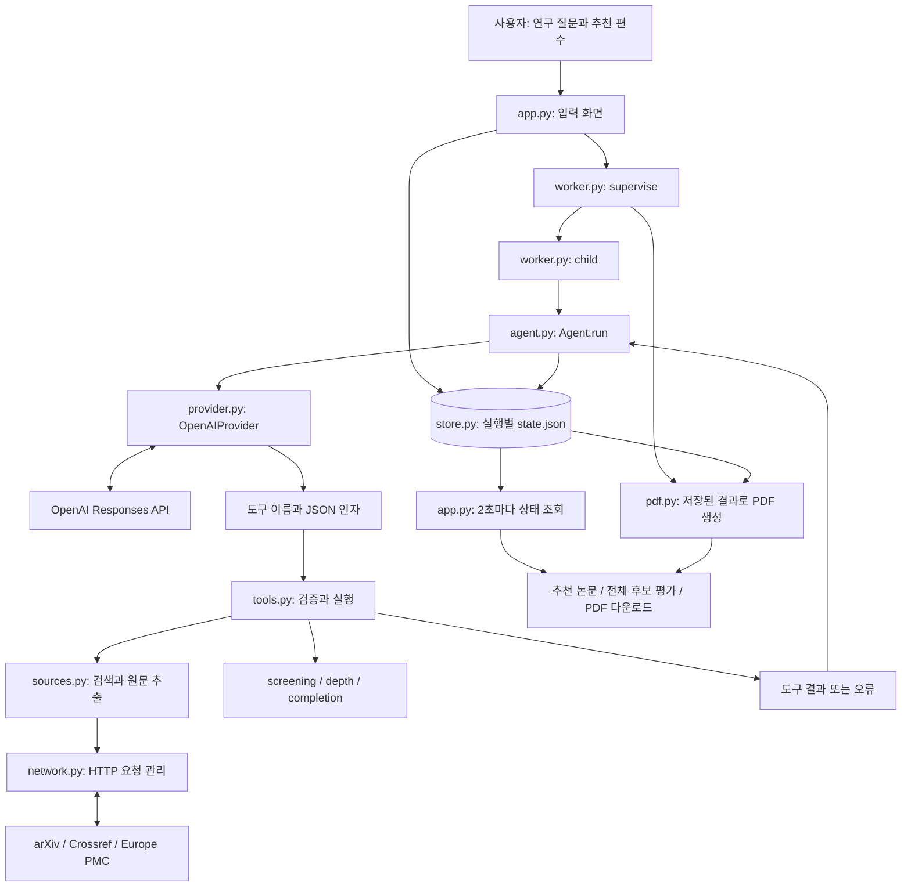
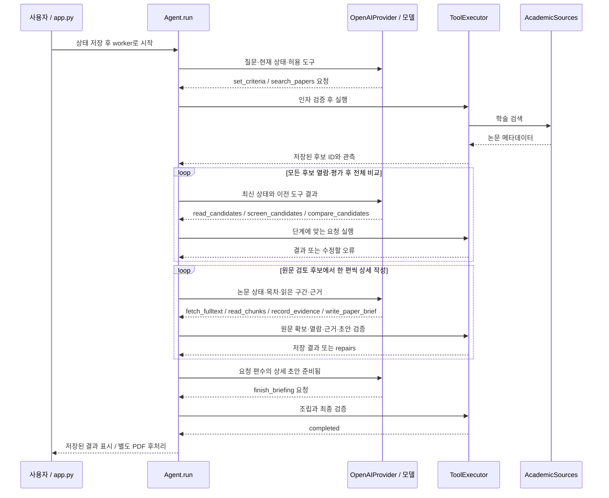

# Paper Trail 코드 구조와 에이전트 동작 설명

이 문서는 발표자가 **사용자 입력이 어떤 파일을 거쳐 논문 브리핑으로 바뀌는지**, **그 과정에서 모델과 Python 코드가 각각 무엇을 하는지** 설명하기 위한 코드 안내서입니다. 2026-09-29의 구현을 기준으로 하며, 별도 표시가 없으면 웹 화면의 **실제 논문 모드**를 설명합니다.

## 1. 발표를 시작할 때 설명할 핵심

> Paper Trail은 연구 질문을 받아 공개 학술 자료를 검색하고, 후보를 비교한 뒤, 선택한 논문의 원문을 읽어 한국어 브리핑을 만드는 프로그램입니다. 하나의 LLM이 현재 상태와 도구 실행 결과를 보고 다음 행동을 선택합니다. Python 코드는 그 행동을 실제로 실행하고, 자료를 저장하며, 근거와 완료 조건을 검사합니다. 이 과정을 반복하는 부분이 에이전트입니다.

구성 요소를 다섯 가지로 나누면 이해하기 쉽습니다.

| 구성 요소 | 이 프로젝트에서의 구현 | 역할 |
|---|---|---|
| 판단하는 모델 | `OpenAIProvider` | 검색어, 후보 평가, 읽을 구간, 브리핑 내용을 결정 |
| 실행 가능한 도구 | `ToolExecutor` | 검색·열람·평가 저장·초안 저장 등을 실제 수행 |
| 작업 기억 | `RunState` + `Store` | 후보, 근거, 대화, 초안, 사용량을 메모리와 JSON에 보존 |
| 반복 제어 | `Agent.run()` | 상태 전달 → 모델 호출 → 도구 실행 → 결과 전달 반복 |
| 완료·실행 제한 | `screening.py`, `depth.py`, `completion.py`, `progress.py`, `worker.py` | 평가 누락·인용·분량·완료 여부와 실행 한도 검사 |

**여러 에이전트가 역할을 나눠 대화하는 구조는 아닙니다.** 단일 에이전트이고, LangChain·LangGraph·MCP 같은 에이전트 프레임워크 없이 Python으로 루프를 직접 구현했습니다. worker 프로세스가 여러 개 등장하는 것은 실행·감시·PDF 후처리를 분리하기 위해서입니다.

## 2. 전체 구조



모델은 학술 사이트를 직접 열거나 로컬 파일을 직접 수정하지 않습니다. 모델은 `search_papers` 같은 **등록된 함수의 호출 요청**을 반환하고, Python 코드가 요청을 검사한 뒤 실행합니다.

### 사용자 요청 한 번의 큰 흐름

1. 사용자가 연구 질문과 최종 추천 편수 1~5편을 입력합니다.
2. `app.py`가 `RunState`를 만들고 저장한 뒤 worker를 시작합니다.
3. worker가 모델 연결과 학술 소스 객체를 만들어 `Agent.run()`을 실행합니다.
4. 에이전트가 검색한 후보의 제목·초록을 모두 평가하고 전체 순위와 원문 검토 후보 목록을 저장합니다.
5. 원문 검토 후보에서 논문 한 편씩 본문을 읽고 근거를 기록한 뒤 상세 초안을 저장합니다.
6. 요청한 편수의 초안이 준비되면 최종 브리핑을 조립하고 검증합니다.
7. 화면은 저장된 결과를 보여 주고, PDF 렌더러는 같은 데이터로 문서를 만듭니다.

4~6번은 매번 똑같은 검색어와 횟수로 실행되는 고정 시나리오가 아닙니다. **코드는 반드시 통과할 검증 단계를 정하고, 모델은 그 안에서 구체적인 행동을 선택합니다.**

## 3. 핵심 파일 지도

파일명을 누르면 구현으로 이동할 수 있습니다. 발표에서는 먼저 굵게 표시한 다섯 파일을 연결해 설명하고, 검증과 저장 구조를 덧붙이면 됩니다.

| 파일 | 중요한 함수·클래스 | 어떤 코드가 들어 있는가 |
|---|---|---|
| **[app.py](../app.py)** | `render_new`, `monitor`, `render_recommendations`, `download_briefing` | 질문 입력, 실행 시작, 진행 표시, 중지·재개, 추천·후보 탭, 다운로드 |
| [worker.py](../paper_agent/worker.py) | `launch`, `supervise`, `child`, `pdf_child` | 별도 프로세스 시작, 동시 실행 잠금, 시간 초과·중지 처리, PDF 후처리 |
| **[agent.py](../paper_agent/agent.py)** | `Agent.run`, `state_view`, `prepare_model_request` | 모델에 보낼 상태 구성, 사용량 예약, 모델 호출, 모든 도구 요청 순회, 결과 저장 |
| **[provider.py](../paper_agent/provider.py)** | `SYSTEM`, `OpenAIProvider.respond`, `Call`, `Turn`, `result_item` | 모델 지침, OpenAI SDK 연결, 응답에서 함수 호출 추출, 결과 메시지 형식 |
| **[tools.py](../paper_agent/tools.py)** | `REGISTRY`, `definitions`, `validate_call`, `ToolExecutor.execute`, `validate_briefing` | 도구 명세와 인자 모델, 단계별 도구 제공, 실제 작업 분기, 최종 검증 |
| **[schema.py](../paper_agent/schema.py)** | `RunState`, `Paper`, `Chunk`, `Evidence`, `PaperBrief`, `Briefing`, `add_paper` | 데이터 구조, 타입·범위 검사, DOI·출처 식별자·제목 기반 중복 제거 |
| [sources.py](../paper_agent/sources.py) | `AcademicSources`, `extract_document`, `chunks_from_sections` | 학술 API별 검색·상세 조회, HTML/XML/PDF 텍스트 추출과 분할 |
| [network.py](../paper_agent/network.py) | `Network.get`, `check_url`, `_throttle` | 허용 호스트, 요청 간격, 제한된 재시도, 시간·다운로드 크기 제한 |
| [screening.py](../paper_agent/screening.py) | `read_candidate`, `record_reviews`, `compare`, `screening_errors` | 모든 후보의 초록 열람·평가, 전체 비교, 자료·기준 변경 시 평가 유효성 검사 |
| [depth.py](../paper_agent/depth.py) | `passages`, `reading_status`, `validate_detailed_paper`, `focus_paper` | 본문 구절 ID, 읽은 구간 수, 상세 초안 분량·인용 검사, 현재 작성할 논문 선택 |
| [completion.py](../paper_agent/completion.py) | `ready_to_finalize`, `completion_directive`, `prepare_resume` | 최종 조립 가능 여부, 다음 작업 안내, 중단된 실행 재개 정책 |
| [progress.py](../paper_agent/progress.py) | `milestones`, `record_progress`, `recovery_instruction` | 실제로 새 자료·근거·초안이 늘었는지 추적하고 반복 작업 감지 |
| [history.py](../paper_agent/history.py) | `model_input`, `windowed_history` | 최신 상태와 필요한 도구 결과로 모델 입력을 구성하고 오래된 이력 축약 |
| [store.py](../paper_agent/store.py) | `Store.save`, `load`, `update_existing`, `trace` | 실행별 JSON 저장·복원, 잠금과 원자적 파일 교체, 대화 항목을 제외한 trace 내보내기 |
| [activity.py](../paper_agent/activity.py) | `describe_tool`, `activity_view` | 이벤트를 검색 사이트·검색어·논문 제목·읽는 구간 등의 진행 문구로 변환 |
| [pdf.py](../paper_agent/pdf.py) | `ensure_pdf`, `render_pdf`, `_render_pdf` | 결과 재검증, 한글 폰트, 페이지 배치, PDF 생성·레이아웃 갱신 |
| [config.py](../paper_agent/config.py) | `load_config`, `default_limits`, `model_name` | 환경 변수와 `.env`를 읽어 모델·저장 위치·실행 한도 설정 |
| [demo.py](../paper_agent/demo.py) | `FixtureSources`, `ReplayProvider` | 합성 논문과 미리 정한 도구 호출을 사용하는 API 없는 데모 |
| [cli.py](../paper_agent/cli.py) | `main` | 화면 없이 동일 worker로 실행하는 명령행 진입점 |
| [evaluation.py](../paper_agent/evaluation.py) | `grade`, `main` | 실제 모델과 합성 자료를 결합한 행동 평가 |

설치 의존성과 `paper-agent` 명령 등록은 [pyproject.toml](../pyproject.toml), 검증 환경의 고정 버전 목록은 [requirements-tested.txt](../requirements-tested.txt), 설정 예시는 [.env.example](../.env.example)에 있습니다.

## 4. 라이브러리는 어디에 쓰이는가?

아래 버전은 최신 버전 안내가 아니라 **이 저장소의 `pyproject.toml`에 선언된 설치 범위**입니다.

| 라이브러리 | 선언 범위 | 사용 위치 | 필요한 이유 |
|---|---|---|---|
| `streamlit` | `>=1.50,<2` | `app.py` | Python으로 입력 폼·탭·진행 화면·다운로드 구현 |
| `openai` | `>=2,<3` | `provider.py` | Responses API 요청과 함수 호출 응답 수신 |
| `pydantic` | `>=2.10,<3` | `schema.py`, `tools.py` | 상태·결과 구조와 인자 타입 검사, 모델에 보낼 JSON Schema 생성 |
| `httpx` | `>=0.28,<1` | `network.py` | 학술 API와 원문 서버에 HTTP 요청 |
| `beautifulsoup4` | `>=4.13,<5` | `sources.py` | HTML 태그 정리와 arXiv 본문 추출 |
| `defusedxml` | `>=0.7,<1` | `sources.py` | arXiv Atom XML과 Europe PMC 원문 XML 파싱 |
| `pypdf` | `>=5,<7` | `sources.py` | 내려받은 PDF에서 페이지별 텍스트 추출 |
| `reportlab` | `>=4.4,<5` | `pdf.py` | 구조화된 브리핑을 한국어 PDF로 렌더링 |
| `python-dotenv` | `>=1,<2` | `config.py` | 로컬 `.env` 설정 로드; 기존 환경 변수가 우선 |
| `filelock` | `>=3.16,<4` | `worker.py`, `store.py`, `network.py`, `pdf.py`, `app.py` | 여러 프로세스의 실행·저장·요청 간격·PDF 생성 충돌 방지 |
| `pytest` / `PyMuPDF` | 개발 의존성 | `tests/`, PDF 검증 스크립트 | 기능 테스트 / PDF 렌더링·텍스트·배치 검사 |

`subprocess`, `json`, `hashlib`, `pathlib`, `time` 등은 Python 표준 라이브러리입니다. 별도 DB나 벡터 DB, 임베딩 모델은 사용하지 않습니다. 검색 API에서 받은 논문을 `Paper` 객체로 저장하고 필요한 원문 구간을 모델에 전달합니다.

## 5. 외부 API와 데이터의 경계

### 5.1 OpenAI: 다음 행동과 브리핑 작성

[provider.py](../paper_agent/provider.py)의 `OpenAIProvider.respond()`가 다음 요청을 보냅니다. 핵심 인자만 발췌하면 다음과 같습니다.

```python
response = self.client.responses.create(
    model=self.model,
    instructions=SYSTEM,
    input=conversation,
    tools=tools,
    tool_choice="required",
    parallel_tool_calls=True,
    max_output_tokens=max_output_tokens,
    timeout=timeout,
    store=False,
    # 실제 코드에는 encrypted reasoning과 선택적 reasoning effort 설정도 있음
)
```

| 인자 | 이 프로그램에서의 의미 |
|---|---|
| `instructions=SYSTEM` | 논문 탐색 역할, 근거 사용, 도구 호출, 완료 정책에 대한 공통 지침 |
| `input=conversation` | 현재 질문·상태와 필요한 이전 함수 호출·결과 |
| `tools=tools` | 현재 단계에 제공하는 함수 이름·설명·JSON Schema |
| `tool_choice="required"` | 일반 답변문 대신 도구 호출로 행동하도록 요청 |
| `parallel_tool_calls=True` | 한 응답에 복수 함수 호출을 받을 수 있도록 설정 |
| `max_output_tokens` / `timeout` | 한 요청의 출력량과 대기 시간 제한 |
| `store=False` | SDK 요청에 전달하는 응답 저장 옵션; 로컬 상태 저장과는 별개 |

**복수 도구 호출을 허용해도 실제 도구는 `Agent.run()`의 `for call in turn.calls`에서 순서대로 실행합니다.** 병렬 실행 에이전트를 구현한 것은 아닙니다.

기본 모델명은 `config.model_name()`의 `gpt-5.4-mini`이며 `OPENAI_MODEL`로 바꿀 수 있습니다. API 키는 환경 변수 `OPENAI_API_KEY`에서 읽습니다. 연구 질문과 모델 입력에 포함된 초록·원문·근거는 OpenAI 요청에 전달됩니다.

### 5.2 학술 API: 실제 자료 확보

다음은 [sources.py](../paper_agent/sources.py)에 구현된 요청 경로입니다. OpenAI의 내장 웹 검색 도구를 쓰는 방식이 아니라, 이 프로그램이 학술 API를 직접 호출합니다.

| 소스 | 코드의 엔드포인트·경로 | 가져오는 자료 |
|---|---|---|
| arXiv 검색 | `https://export.arxiv.org/api/query` | Atom XML의 제목·저자·연도·초록·식별자 |
| arXiv 원문 | `https://arxiv.org/html/{id}`, `https://arxiv.org/pdf/{id}` | HTML 본문 또는 PDF 텍스트 |
| Europe PMC 검색 | `https://www.ebi.ac.uk/europepmc/webservices/rest/search` | JSON 메타데이터·초록·PMCID 등 |
| Europe PMC 원문 | 같은 REST 루트의 `/{pmcid}/fullTextXML` | 공개 원문 XML |
| Crossref | `https://api.crossref.org/works`, `/works/{doi}` | DOI와 서지정보, 제공되는 경우 초록 |

Crossref는 이 구현에서 메타데이터 소스입니다. DOI가 있다고 임의의 출판사 페이지를 열어 원문을 가져오지는 않습니다. 원문에 필요한 arXiv/PMC 식별자가 없으면 도구가 오류를 돌려주고, 모델이 다른 소스에서 검색하거나 후보를 바꿉니다.

`Network`는 허용된 HTTPS 호스트만 요청하고 리다이렉트도 검사합니다. 코드의 요청 간격은 arXiv 계열 3.1초, 다른 호스트 1초이며 기본 재시도 횟수는 1회입니다. 이는 **프로젝트가 구현한 제한값**입니다.

## 6. 시작 버튼을 누르면 어떤 코드가 실행되는가?

### 6.1 `app.py`: 입력을 실행 상태로 바꾸기

`render_new()`는 질문·원하는 도움·제약·이미 읽은 논문을 `Context`에 넣습니다. 실제 모드의 새 실행에는 다음 정책이 켜집니다.

```python
# render_new()의 실제 모드 상태를 설명하기 위한 축약 예시
state = RunState(
    mode="live",
    context=Context(
        question=question.strip(),
        help_wanted=help_wanted,
        constraints=constraints,
        already_read=already_read,
    ),
    limits=default_limits(),
    model=model_name(),
    require_target=True,
    require_screening=True,
    require_depth=True,
)
state.limits.target = target
store.save(state)
launch(store, state.id)
```

- `require_target`: 요청한 추천 편수와 정확히 일치해야 완료합니다.
- `require_screening`: 검색해 저장한 모든 후보를 평가·비교해야 합니다.
- `require_depth`: 원문을 추가 검토하고 논문별 상세 초안을 검증해야 합니다.

위 코드는 실제 모드에 초점을 맞춘 발췌이며, 전체 생성 코드는 `render_new()`에 있습니다.

### 6.2 `worker.py`: 화면과 실제 작업 분리

```text
Streamlit 프로세스
  └─ launch(): supervisor 프로세스 시작
       ├─ supervise(): 전역 worker.lock + 실행별 run.lock 확보
       ├─ child 프로세스: 모델 연결 + 학술 소스 + Agent.run()
       └─ child 종료 후 pdf 프로세스: 저장된 상태 → PDF
```

`child()`에서 실제 모드는 `OpenAIProvider`와 `AcademicSources(Network(...))`를, 데모 모드는 `ReplayProvider`와 `FixtureSources`를 주입합니다. **같은 `Agent` 루프에 모델 응답 공급자와 자료 공급자를 바꿔 끼우는 구조**입니다.

`monitor()`는 `@st.fragment(run_every="2s")`로 상태 파일을 다시 읽습니다. 화면 갱신 자체가 모델 호출을 새로 시작하지 않습니다. supervisor는 중지 파일과 실행 시간을 감시하므로 모델 응답이나 PDF 파싱을 기다리는 동안에도 작업을 제한할 수 있습니다.

## 7. 에이전트의 핵심: `Agent.run()`

다음은 실제 구현의 핵심 관계를 보여 주는 **설명용 의사 코드**입니다. 사용량 정산·중복 호출·예외 처리 등은 줄였습니다.

```python
while 작업을_계속할_수_있음:
    snapshot, conversation, tool_defs, ... = prepare_model_request(state)
    turn = provider.respond(conversation, tool_defs, ...)
    state.conversation.extend(turn.items)

    for call in turn.calls:
        args = validate_call(call.name, call.arguments)
        result = executor.execute(call.name, args)
        state.conversation.append(result_item(call, result))
        save()

    record_progress(state)
    if state.status in 종료_상태:
        break
```

실제 순서는 다음과 같습니다.

1. `budget_reason()`이 중지 요청·시간·도구·토큰·반복 한도를 검사합니다.
2. `state_view()`가 질문, 목표, 기준, 후보 상태, 근거, 남은 사용량, 다음에 필요한 작업을 구성합니다.
3. `prepare_model_request()`가 대화 이력과 현재 제공할 도구를 준비하고 입력·출력 예약량을 계산합니다.
4. 호출 횟수와 토큰 예약량을 **요청 전에 저장**한 다음 `provider.respond()`를 호출합니다.
5. `Turn`에 담긴 함수 호출을 하나씩 검사하고 실행합니다. 실제 사용량이 응답에 있으면 예약량을 정산합니다.
6. 성공한 결과와 실패 이유를 모두 같은 `call_id`의 `function_call_output`으로 저장합니다.
7. 다음 모델 호출은 이 결과를 입력으로 받아 검색을 더 하거나, 읽거나, 오류를 수정하거나, 완료를 요청합니다.

### 왜 `call_id`가 중요한가?

예를 들어 모델이 다음 호출을 반환했다고 가정합니다. ID와 논문 번호는 설명용입니다.

```json
{
  "type": "function_call",
  "call_id": "call_demo_1",
  "name": "fetch_fulltext",
  "arguments": "{\"decision\":\"공개 원문 확인\",\"paper_id\":\"p_demo\",\"route\":\"html\"}"
}
```

도구가 실패하면 Python은 다음 형태의 결과를 만듭니다.

```json
{
  "type": "function_call_output",
  "call_id": "call_demo_1",
  "output": "{\"ok\":false,\"error\":\"arXiv HTML 본문 없음. PDF 경로를 시도할 수 있습니다.\"}"
}
```

모델은 **어떤 요청이 왜 실패했는지** 알 수 있고, 다음 응답에서 `route="pdf"`를 선택할 수 있습니다. Python이 HTML 실패 후 무조건 PDF를 고르는 코드는 없습니다. 같은 HTTP 요청의 일시 오류 재시도는 `network.py`가 담당하고, 경로나 후보를 바꾸는 결정은 모델이 담당합니다.

`decision`은 “공개 원문 확인” 같은 짧은 행동 설명입니다. 모델의 내부 사고 과정 전체를 출력하는 필드가 아닙니다.

## 8. 도구는 어떻게 정의하고 제한하는가?

### 8.1 Pydantic 모델 → JSON Schema → Python 실행

`tools.py`의 `Search`는 `source`, `query`, `limit`, `offset`과 공통 필드 `decision`을 정의합니다. 예를 들어 `source`는 `arxiv`, `europepmc`, `crossref` 중 하나이며 `limit`은 1~15입니다.

```text
Search 같은 Pydantic 인자 모델
  → REGISTRY에 함수 이름·설명과 함께 등록
  → definitions(state)가 model_json_schema()로 도구 명세 생성
  → OpenAI에 tools로 전달
  → 모델이 함수 이름과 JSON 인자 반환
  → validate_call()이 strict=True로 인자 검사
  → ToolExecutor.execute()가 해당 분기를 실행
```

`StrictModel`의 `extra="forbid"`는 정의하지 않은 필드를 거부합니다. `validate_call()`은 알 수 없는 도구 이름, 너무 큰 인자, 잘못된 타입·범위, 일부 arXiv 검색 문법도 검사합니다.

### 8.2 실제 모드에서 주로 사용하는 도구

| 단계 | 도구 | 실제로 일어나는 작업 |
|---|---|---|
| 목표 설정 | `set_criteria` | 해석한 목표와 공통 선정 기준을 상태에 저장 |
| 검색 | `search_papers` | 학술 API 검색, 중복 병합, 후보·검색 이력 저장 |
| 후보 열람 | `read_candidates`, `get_metadata` | 제목·초록 반환, 실제 반환한 초록 범위 기록 |
| 후보 평가 | `screen_candidates` | 관련성·방법 적합성·원문 검토 가치, 이유·분류·근거 구절 저장 |
| 전체 비교 | `compare_candidates` | 모든 후보의 순위, 비교 이유, 원문 검토 후보 목록인 `shortlist` 저장 |
| 원문 확보 | `fetch_fulltext` | HTML/XML/PDF를 텍스트 청크로 변환해 저장 |
| 구간 선택·열람 | `list_sections`, `read_chunks` | 목차 조회, 선택한 청크의 원문 구절 반환, 읽은 구간 기록 |
| 근거 기록 | `record_evidence` | 원문 구절 ID를 검증해 정확한 인용문·주장·평가를 저장 |
| 한 편 작성 | `write_paper_brief` | 원문 검토와 초안 분량·인용을 검사해 `paper_briefs`에 저장 |
| 완료 요청 | `finish_briefing` | 저장된 초안을 지정한 순서로 조립하고 최종 검증 |

모든 도구를 매번 제공하지는 않습니다. `definitions(state)`가 단계에 따라 목록을 줄입니다.

- 읽지 않은 미평가 후보만 남아 있으면 후보 열람 도구를 제공합니다.
- 이미 읽은 미평가 후보가 있으면 `screen_candidates`를 제공합니다.
- 개별 평가가 끝났으나 전체 비교가 최신이 아니면 `compare_candidates`만 제공합니다.
- 상세 작성 중에는 `focus_paper()`가 고른 논문에 맞춰 관련 `paper_id`와 근거 ID 선택지를 제한합니다.
- 검증된 초안이 요청 편수만큼 준비되면 추가 검색을 제외하고 최종 작성·보완 도구를 제공합니다.

도구 목록 제한 외에도 실행 시 `screening_errors()` 등으로 필수 조건을 검사합니다. 모델 지침만으로 “꼭 모든 후보를 평가하라”고 부탁하는 구조보다 강한 제어입니다.

### 8.3 코드에 남아 있는 다른 도구와의 관계

`assess_candidate`, `submit_briefing`, `ask_user`, `stop_incomplete`도 등록되어 있습니다. 하지만 새 실제 모드에서 모델에 직접 제공하는 작성 경로는 `record_evidence` → `write_paper_brief` → `finish_briefing`입니다.

- `record_evidence`는 구절 ID를 실제 인용문으로 바꾸고 내부에서 `assess_candidate`를 재사용합니다.
- `finish_briefing`은 저장된 초안을 조립한 뒤 내부에서 `submit_briefing`을 재사용합니다.
- `require_target=True`이면 `ask_user`와 `stop_incomplete`는 제공하지 않으며 잘못 요청해도 조기 종료하지 않습니다.
- 이전 저장 기록과 일부 평가 모드는 다른 정책을 쓸 수 있습니다. 새 실제 모드도 오류·시간·사용량·반복 한도 때문에 불완전 종료될 수 있습니다.

## 9. 자료는 어떤 구조로 저장되는가?

### 9.1 `RunState`가 실행 전체의 중심

| 필드 | 저장 내용 |
|---|---|
| `context`, `goal`, `criteria` | 원래 사용자 입력과 모델이 정리한 목표·기준 |
| `papers` | `paper_id`별 서지정보, 초록, 청크, 열람 상태, 평가 |
| `candidate_comparison` | 전체 순위·비교 이유·원문 검토 후보 목록 |
| `evidence` | `evidence_id`별 논문·청크·정확한 인용문·주장·해석 구분 |
| `paper_briefs` | 검증을 거쳐 저장한 논문별 상세 초안 |
| `briefing` | 최종 조립된 브리핑 |
| `conversation` | 모델과 주고받은 로컬 API 대화 항목 |
| `events` | 모델 요청·도구 요청·도구 결과·종료 등 실행 이벤트 |
| `limits`, `usage`, `progress_markers` | 한도, 누적 사용량, 이미 달성한 진전 |
| `status`, `stop_reason` | 실행 상태와 종료 이유 |

근거의 연결 관계는 다음과 같습니다.

```text
RunState
 ├─ papers[paper_id]: Paper
 │   ├─ title / authors / year / doi / abstract
 │   ├─ screening: CandidateReview
 │   ├─ chunks[chunk_id]: Chunk(text, location, source_url)
 │   └─ read_chunks: 실제 열람한 청크 ID 목록
 ├─ evidence[evidence_id]: Evidence(paper_id, chunk_id, quote, claim, kind)
 ├─ paper_briefs[paper_id]: PaperBrief
 │   └─ problem / method / results / limitations 등
 │       └─ CitedText(text, kind, evidence_ids)
 └─ briefing: Briefing(papers, reading_order 등)
```

브리핑의 주장은 `evidence_ids`로 근거 노트를 가리키고, 노트는 논문의 청크와 인용문을 가리킵니다. 이 연결을 따라가면 어떤 원문 구간을 사용했는지 검사할 수 있습니다.

### 9.2 원문 확보와 읽기는 다르다

`fetch_fulltext`는 텍스트를 로컬 상태에 저장하고 목차를 반환합니다. 전체 원문을 모델에 한 번에 전달하거나 읽은 것으로 처리하지 않습니다.

`chunks_from_sections()`는 정규화한 텍스트를 최대 3,200자 단위로 나누고 최대 100개 청크를 만듭니다. PDF는 최대 120페이지에서 텍스트를 추출합니다. 각 청크에는 `c001` 같은 ID와 절·페이지·문자 범위가 붙습니다.

모델이 `read_chunks`로 최대 4개 청크를 요청하면 해당 구간이 반환되고 `read_chunks` 목록에 기록됩니다. 상세 모드는 원문을 `depth.passages()`에서 대략 400자 단위의 구절과 `quote_id`로 나누어 전달합니다. 모델은 `record_evidence`에서 ID를 선택하고, 프로그램이 해당 구절의 정확한 텍스트를 근거로 저장합니다.

PDF 페이지 번호는 실제 페이지를 가리킵니다. HTML/XML의 문자 위치는 추출·공백 정규화한 텍스트 기준이며 웹 페이지의 바이트 위치는 아닙니다. 스캔본 OCR이나 표·수식·이미지의 완전한 해석은 구현되어 있지 않습니다.

### 9.3 파일 저장과 모델의 기억

기본 저장 위치는 `data/<실행 ID>/state.json`이고 PDF는 같은 폴더의 `briefing.pdf`입니다. `Store.save()`는 잠금을 잡고 임시 파일에 기록한 뒤 `fsync`와 `os.replace()`로 교체합니다. 화면이 저장 중간의 불완전한 JSON을 읽는 상황을 줄이기 위한 구조입니다.

모델이 이전 실행 내용을 저절로 기억하는 것은 아닙니다. 매 요청마다 프로그램이 상태와 필요한 대화를 다시 보냅니다. `history.py`는 오래된 상태 스냅샷을 최신 하나로 대체하고 최근 응답 그룹을 유지합니다. 기본적으로 실제 모드는 최근 두 그룹, 최종 조립 단계는 한 그룹을 사용하되 미평가 자료와 작성 전 필요한 원문 관측 등은 추가로 보존합니다. 로컬 원본 대화와 모델에 보내는 축약 입력은 구분됩니다.

`Store.trace()`는 `conversation`을 제외하고 이벤트·사용량을 내보내지만 연구 질문이나 자료가 이벤트에 포함될 수 있습니다. 로컬 상태·실행 내보내기는 저장소에 커밋하지 않습니다.

## 10. 결과를 어떻게 검증하는가?

### 후보 전체를 평가했는가: `screening.py`

검색 응답의 짧은 초록 미리보기만으로 평가 완료를 인정하지 않습니다. `read_candidates` 또는 `get_metadata`로 필요한 제목·초록 범위를 받은 기록을 확인합니다. 열람과 평가는 서로 다른 모델 턴이어야 하므로 **아직 도구 결과를 받기 전에 평가부터 만들어 내는 호출**을 거부합니다.

각 평가는 자료와 선정 기준의 해시를 저장합니다. 전체 비교는 후보 집합과 평가의 해시를 저장합니다. 후보·자료·기준이 바뀌면 관련 평가 또는 비교가 더 이상 최신으로 인정되지 않습니다. `compare_candidates`의 순위에는 제외 후보까지 모든 ID가 정확히 한 번씩 들어가야 합니다.

세 항목의 0~5점은 모델이 공통 기준으로 평가한 값입니다. 프로그램이 점수를 합산해 자동으로 상위 논문을 선택하는 방식은 아닙니다. 순위·비교 이유·원문 검토 후보는 모델이 결정합니다.

### 충분히 읽고 작성했는가: `depth.py`

현재 상세 검증은 다음을 검사합니다.

- 참고문헌을 제외한 청크를 최소 8개 읽었는가? 짧은 원문이면 해당 청크 전체를 읽었는가?
- 문제·방법·결과·한계 설명이 각각 최소 180·350·300·200자인가?
- 네 항목의 근거가 최소 4개 구간에 걸쳐 있는가? 짧은 원문에는 완화된 기준을 적용하는가?
- 방법과 결과에 초록·서론 등으로 판정되지 않는 구간의 근거가 각각 있는가? 두 항목의 근거 청크 집합이 동일하지 않은가?
- 인용 ID가 같은 논문의 실제 열람 구간과 연결되는가?

절 종류는 `overview()`가 제목 문자열로 판정하므로 방법·결과의 의미를 이해하는 판정기는 아닙니다. 특히 PDF는 페이지 위치를 주로 사용하므로 절 구분에도 한계가 있습니다.

`write_paper_brief`는 추가로 마지막 본문 열람이 현재 모델 턴보다 이전인지 확인합니다. 실패하면 `repairs` 목록을 반환하고, 모델이 다음 턴에 부족한 구간을 읽거나 초안을 수정하게 합니다.

### 완료해도 되는가: `tools.py`와 `completion.py`

`ready_to_finalize()`는 요청 편수만큼 유효한 상세 초안과 원문 근거가 있는지, 전체 후보 평가·비교가 유효한지 검사합니다. `finish_briefing`은 초안을 새로 요약하지 않고 조립합니다. 내부 `validate_briefing()`은 편수·중복·원문 확보·열람·`keep` 평가·후보 목록 포함 여부·인용 연결 등을 다시 검사합니다.

**검증 통과는 근거 연결과 절차를 만족했다는 뜻입니다.** 인용문이 주장을 의미적으로 충분히 뒷받침하는지, 연구 비교가 타당한지, 논문 자체가 신뢰할 만한지까지 자동 보장하지는 않습니다.

## 11. 중단·재개·반복 방지

새 실행은 `ready → running`으로 진행하고 검증된 제출이 통과하면 `completed`가 됩니다. 한도 소진은 `incomplete`, 모델·작업 오류는 `error`, 사용자 중지는 `cancelled`로 기록합니다. 질문 대기용 `waiting`도 있지만 새 실제 모드에서는 해당 질문 도구를 제공하지 않습니다.

| 제어 | 담당 | 동작 |
|---|---|---|
| 요청 전 한도 | `Agent.budget_reason`, `prepare_model_request` | 시간·호출·도구·토큰·반복 한도 검사와 사용량 예약 |
| 검색·원문 한도 | `ToolExecutor` | 검색 수, 활성 후보 자리, 서로 다른 원문 시도 논문 수 제한 |
| 진전 없는 반복 | `progress.py` | 새 후보·열람 범위·근거·유효 초안 등의 진전이 없으면 연속 횟수 증가 |
| 강제 중지·시간 초과 | `worker.supervise` | `stop` 파일 또는 시간 한도를 감지해 child 종료 |
| 재개 | `completion.prepare_resume` | 자료·초안·누적 사용량을 유지하고 다시 `ready`로 전환 |

기본값은 검색 6회, 도구 80회, 서로 다른 원문 시도 5편, 실행 시간 480초입니다. 진전 없는 호출이 3회 연속이면 복구 지시를 보내고 기본 6회면 중단합니다. 모델 호출 수·최종 작성 호출 수·총 토큰은 기본 `auto`로 고정 상한이 없지만 나머지 한도는 적용됩니다.

중단 직전에 실행 결과를 저장하지 못한 호출은 `close_interrupted_calls()`가 `execution_interrupted`로 연결합니다. 성공했다고 가정하거나 자동 재실행하지 않습니다. 재개할 때도 기존 누적 사용량은 초기화하지 않습니다.

## 12. PDF와 화면의 관계

LLM이 작성하는 것은 `PaperBrief`의 설명과 근거 연결입니다. 실제 PDF 파일의 페이지·폰트·줄바꿈·링크 배치는 [pdf.py](../paper_agent/pdf.py)의 ReportLab 코드가 담당하며 이 단계에서는 모델을 호출하지 않습니다.

`_render_pdf()`는 브리핑을 재검증하고 한글 폰트를 등록한 뒤 논문별 제목·저자·연도·링크와 다음 네 항목을 출력합니다.

1. 다루는 문제
2. 핵심 방법
3. 주요 결과
4. 한계와 해석

`PaperBrief`에는 선정 이유와 활용 설명 등 더 많은 내부 필드가 있지만 현재 추천 화면과 PDF는 위 네 항목을 중심으로 보여 줍니다. 전체 후보의 평가·순위는 화면의 별도 탭에 표시합니다. PDF에는 연구 입력·선정 기준·미선정 후보·실행 로그·별도 출처 목록을 넣지 않으며, 인용 연결은 내부 검증 데이터에 남습니다.

## 13. 실제 실행과 데모·평가의 차이

| 모드 | 모델 응답 | 논문 자료 | 설명할 수 있는 것 |
|---|---|---|---|
| `live` | 실제 `OpenAIProvider` | 실제 `AcademicSources` | 모델 판단과 외부 검색·원문 검토를 연결한 실행 |
| `demo` | 고정 `ReplayProvider` | 합성 `FixtureSources` | 화면·루프·도구 연결·저장·출력 동작 |
| `model_eval` | 실제 `OpenAIProvider` | 합성 `FixtureSources` | 통제된 빈 검색·원문 실패·조건 불일치에 대한 모델 행동 평가 |

데모는 실제 모델의 자율 판단을 보여 주는 증거가 아닙니다. 실제 모드의 호출 흐름은 질문·검색 결과·원문 접근성·모델 판단에 따라 달라집니다.

[examples/three_levels.py](../examples/three_levels.py)는 단순 LLM 호출, 고정 워크플로, 에이전트 루프를 비교하는 보조 예제입니다. 다만 이 파일의 `agent` 분기는 `RunState`의 세 필수 정책을 별도로 켜지 않아 현재 웹의 상세 검토 정책과 같지 않습니다. **발표에서 현재 제품 동작을 설명할 때는 `app.py → worker.py → Agent.run()`을 기준으로 보는 것이 정확합니다.**

## 14. 한 요청을 따라가며 설명하는 발표 예시

다음은 “적은 라벨로 문서 분류를 학습하는 방법 3편”이라는 요청을 설명하기 위한 **가상 실행 예시**이며 고정된 호출 순서나 실제 실행 기록이 아닙니다.



발표 중에는 다음 세 지점을 강조하면 에이전트가 무엇인지 드러납니다.

1. **검색 결과가 부족한 경우:** 도구는 빈 결과를 반환하고, 모델이 다음 검색어·소스·페이지를 선택합니다.
2. **원문을 못 여는 경우:** 실패 결과가 다음 모델 입력으로 들어가고, 모델이 다른 경로나 후보를 선택합니다.
3. **초안 근거가 부족한 경우:** 검증기가 부족한 항목을 반환하고, 모델이 추가 열람·근거 기록·수정을 수행합니다.

## 15. 발표용 코드 열람 순서와 예상 질문

### 5~7분 설명 순서

| 순서 | 열 파일·위치 | 설명할 내용 |
|---|---|---|
| 1 | `app.py`의 `render_new` | 사용자의 질문을 `RunState`로 만들고 작업 시작 |
| 2 | `worker.py`의 `child` | 실제 모드와 데모 모드의 객체 주입, 화면과 작업 분리 |
| 3 | `agent.py`의 `Agent.run` | 상태 → 모델 → 도구 → 관측의 반복이 핵심 |
| 4 | `provider.py`의 `respond` | 모델에 함수 목록을 전달하고 함수 호출을 받는 API 경계 |
| 5 | `tools.py`의 `REGISTRY`, `definitions`, `execute` | 가능한 행동의 정의·제한·실제 실행 |
| 6 | `schema.py`, `screening.py`, `depth.py` | 원문부터 근거와 초안까지 연결하고 완료 조건 검사 |
| 7 | `pdf.py`의 `_render_pdf` | 검증된 데이터로 결과 문서 생성 |

### 예상 질문

**“일반 챗봇과 어떤 차이가 있나요?”**

답변 한 번으로 끝나지 않고 도구를 실행해 외부 자료를 얻고, 그 결과를 다음 판단에 반영하는 루프가 있습니다. 모델의 문장 출력만으로 완료되지 않으며 최종 데이터 검증을 통과해야 합니다.

**“순서가 정해져 있는데 자율 에이전트인가요?”**

필수 평가·검증 단계는 코드가 통제합니다. 그 안에서 검색 전략, 읽을 구간, 논문 교체, 오류 수정, 작성 내용은 모델이 관측을 보고 결정합니다. 완전히 자유로운 에이전트보다는 검증 조건을 둔 도구 사용 에이전트라고 설명할 수 있습니다.

**“모든 논문의 원문을 다 읽나요?”**

저장한 모든 후보의 제목·초록을 평가하고, 원문 검토 후보 목록에서 추가 검토합니다. 원문도 추출 상한과 선택한 구간 범위 안에서 읽습니다. 전 세계 논문 전체나 모든 원문의 완독을 의미하지 않습니다.

**“RAG나 벡터 검색을 사용하나요?”**

외부 근거를 모델에 제공한다는 공통점은 있지만, 이 구현에는 임베딩 생성·벡터 DB·유사도 검색 파이프라인이 없습니다. 학술 API 검색과 모델이 선택한 청크 열람을 사용합니다.

**“환각을 완전히 막나요?”**

저장된 논문·읽은 구간·실제 인용문과 연결되지 않은 근거 사용을 검사합니다. 내용의 의미와 연구 해석까지 증명하지는 않으므로 사람의 검토가 필요합니다.

**“어떻게 테스트하나요?”**

[test_loop.py](../tests/test_loop.py)는 도구 요청·결과·수정의 반복을, [test_screening.py](../tests/test_screening.py)는 후보 전체 평가를, [test_detail_target.py](../tests/test_detail_target.py)는 추천 편수와 상세 작성 조건을 검사합니다. [test_worker.py](../tests/test_worker.py)는 프로세스 실행·중지를, [test_history.py](../tests/test_history.py)는 모델 입력의 이력 처리를 다룹니다. 실제 소스 확인은 [source_smoke.py](../scripts/source_smoke.py), 실제 모델과 소스를 잇는 실행은 [e2e.py](../scripts/e2e.py)로 구분합니다. 이 문서를 위한 코드 확인과 실제 API 실행 검증은 서로 다른 작업입니다.

더 자세한 설계 기록은 [ARCHITECTURE.md](ARCHITECTURE.md), 시연 안내는 [DEMO.md](DEMO.md), 과거 검증 이력은 [VALIDATION.md](VALIDATION.md)를 참고하세요. 과거 기록의 정책·숫자는 당시 버전 기준이므로 현재 흐름은 이 문서가 연결한 코드를 기준으로 설명하세요.
